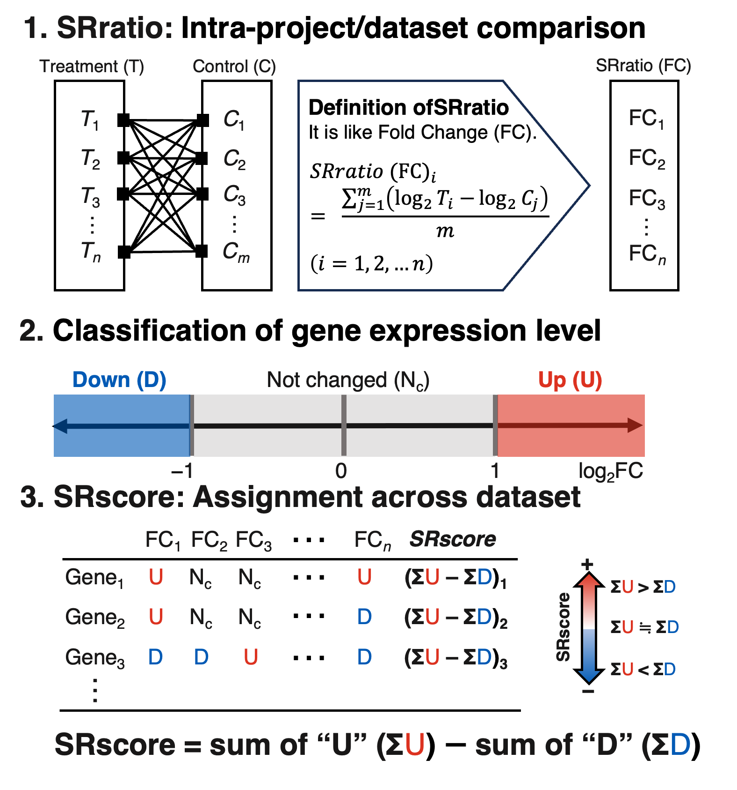

```{r, include = FALSE}
knitr::opts_chunk$set(
  collapse = TRUE,
  comment = "#>"
)
```

**R version**: `r R.version.string`

**Bioconductor version**: `r BiocManager::version()`

**Package**: `r packageVersion("SRscore")`

<style type="text/css">
.main-container {max-width: 1500px;}
</style>

# Introduction

Sharing biological data such as genomic, epigenomic, and transcriptomic data is a crucial initiative that enhances research transparency, promotes data reuse, and facilitates large-scale data reanalysis. Representative public repositories include the Gene Expression Omnibus (GEO)  [@10.1093/nar/gkad965], the Sequence Read Archive (SRA) [@10.1093/nar/gkab1053], and ArrayExpress [@10.1093/nar/gkaa1062], have greatly contributed to this effort. As the value of such data continues to increase, careful consideration is required when handling individual research datasets. Each study inherently involves various technical factors (e.g., experimenters, reagents, and measurement instruments), as well as biological factors (e.g., species, developmental stage, and tissue). Both technical and biological variations have been well documented to influence the reproducibility of microarray and RNA sequencing (RNA-Seq) experiments [@FISCHER20221208].

Meta-analysis has emerged as a promising strategy for addressing these challenges, enabling the identification of reliable gene expression changes and underlying biological processes. It is a statistical method for integrating the results of multiple studies on the same topic, and is widely applied in genome research [@10.1093/nar/gkr1265].
For example, on the basis of the vote-counting method, earlier studies identified abiotic stress-responsive genes in *A. thaliana* and *Oryza sativa* [@life12071079 ; @10.3389/fpls.2024.1343787]. This method led to the development of a p53 Expression Score to capture p53-dependent gene expression [@10.1093/nar/gkw523].
Reanalysis of transcriptomic data across multiple studies is expected to identify significant differences that were not detected in individual studies. For example, see [@10.1371/journal.pcbi.1009317 ; @https://doi.org/10.1111/gtc.13166].

 In our previous study [@10.1093/plphys/kiaf105], we introduced the Stress Response score (SRscore) as a new metric using a modified vote-counting method based on methods reported in earlier studies [@biomedicines9050582 ; @life12071079]. When calculating fold-changes (FCs), whereas the HN-score [@biomedicines9050582 ; @life12071079] restricts the predefined combinations of experimental and control groups, the SRscore considers all possible combinations.

We developed the R package *SRscore* to facilitate a simple and intuitive transcriptome meta-analysis across multiple research projects. The *SRscore* package was designed to address two key issues: (1) although some existing tools employ the vote-counting method, they are not structured for seamless integration into downstream analyses, and (2) the substantial effort and time required for meta-analyses often limits research efficiency. The *SRscore* package offers a standardized meta-analysis pipeline that can be readily utilized by researchers without specialized expertise in bioinformatics. Its applicability extends beyond stress response analysis, encompassing a broad spectrum of two-group comparisons, including organ-specific and drug-induced responses. The primary output, the SRscore, serves as an integrative metric that quantifies the number of studies supporting a particular finding, thereby providing an intuitively interpretable measure of reproducibility and consensus.

# Installation
```{r install}
# library(devtools)
# install_github("fusk-kpu/SRscore", build_vignettes = TRUE)
library(SRscore)
```

# Functions Overview
- `expand_by_group()`	Creates a data frame containing all possible control-treatment sample combinations within each group.

- `calcSRratio()`	Calculates the gene expression ratio between control and treatment samples.

- `calcSRscore()`	Computes the SRscore, summarizing overall gene expression trends.

- `directly_calcSRscore()`	Executes all steps above and returns the results as a list.

- `find_diffexp()`	Retrieves expression ratios for the specified gene across experiments.

# Demonstration datasets

The *SRscore* package includes three demonstration datasets derived from microarray studies available in the GEO database (https://www.ncbi.nlm.nih.gov/geo/) and our previous study [@10.1093/plphys/kiaf105]. Of these, two datasets include six GEO series examining A. thaliana under abscisic acid (ABA) treatment conditions, corresponding to the accession numbers GSE6638, GSE7112, GSE19520, GSE28800, GSE39384, and GSE135489. The demo datasets are a practical resource for users to gain a basic understanding of the SRscore analysis workflow. The following datasets are available in the *SRscore* package.

## MetadataABA

The SRscore package includes metadata, provided as object `MetadataABA`. These datasets contain information corresponding to the microarray studies described above. The following details were extracted from GEO records associated with the listed GEO accession numbers.

- Study ID (e.g., GSE; a unique identifier for each study)
- Sample ID (e.g., GSM; a unique identifier for each sample)
- Tissue
- Processing conditions

The primary role of the metadata in the *SRscore* package is to define the sample combinations to be compared within each study. Consequently, the minimum required information comprises only the study ID and sample ID.


```{r metadata}
library(tibble)
data("MetadataABA")
tibble(MetadataABA)
```

## TranscriptomeABA

The package includes a gene expression dataset called `TranscriptomeABA`, which stores sample × gene expression profiles. All microarray data were downloaded from GEO as raw CEL files and preprocessed using the Robust Multi-array Average (RMA) [@Irizarry2003-uj], as implemented in the Bioconductor package *affy* [@10.1093/bioinformatics/btg405].
	Users can also perform the analysis workflow with their own data by replacing the contents of the demo datasets, provided that the data conform to the same format. This flexibility allows the workflow to be extended to other platforms, such as RNA-Seq, to different omics fields, such as metabolomics, and to experimental conditions beyond stress responses, including drug treatments.

```{r transcriptome}
data("TranscriptomeABA")
tibble(TranscriptomeABA)
```

## SRGA (Stress Responsive Gene Atlas)

These data were generated by integrating SRscores calculated separately from the experimental datasets under 11 different stress conditions [@10.1093/plphys/kiaf105]. Given that the SRscore scale differs among different conditions, the values were standardized using z-scores. In subsequent Template Matching [@Pavlidis2001-ie], we searched for genes with similar SRscore patterns under different stress conditions based on `SRGA`.

```{r srga}
data("SRGA")
tibble(SRGA)
```

# Example Workflow
## 1. Comparison Pairs

The `expand_by_group()` function generates all possible combinations between the two groups (control and stress-treated groups) in each research project.

```{r comparison}
grp <- "Series"
var1 <- "control_sample"
var2 <- "treated_sample"

ebg <- expand_by_group(
  .data = MetadataABA,
  grp = grp,
  var1 = var1,
  var2 = var2
)

unique_series <- unique(MetadataABA$Series)
unique_series

lapply(unique_series, function(x) subset(ebg, Series == x))
```

## 2. Calculation of the SRratio

The `calcSRratio()` function calculates the SRratio, which is the average gene expression ratio calculated based on combinations. If the argument `is.log2` is set to FALSE, the logarithmic conversion is performed using 2 as the base.

```{r SRratio}
SRratio <- calcSRratio(
  .data = TranscriptomeABA,
  var1 = var1,
  var2 = var2,
  pair = ebg,
  is.log2 = TRUE
)

tibble(SRratio)
```

Alternatively, you can calculate SRratio directly without using `expand_by_group()`, as in [@life12071079].

```{r conventional SRratio}
conventional_SRratio <- calcSRratio(
  TranscriptomeABA,
  var1 = var1,
  var2 = var2,
  pair = MetadataABA,
  is.log2 = TRUE
)

tibble(conventional_SRratio)
```

## 3. Calculate SRscore

The SRscore summarizes gene expression variations across the entire dataset by classifying the SRratio according to a pre-specified threshold. However, although this threshold can be freely specified, by default, log2FC values above 1 (corresponding to a 2-fold change on the linear scale) are classified as an increase in expression, whereas values below -1 (corresponding to a 1/2-fold change on the linear scale) correspond to a decline in expression, and values between -1 and 1 signify no change. The SRscore is calculated by subtracting the total number of expression decrease determinations from the total number of expression increase determinations.

```{r SRscore}
SRscore <- calcSRscore(SRratio, threshold = c(-2, 2))
head(SRscore)
tibble(SRscore)
```

## Simple Plotting
Here, we introduce fundamental visualization functions to aid in the intuitive understanding of the SRscore, the primary output of the SRscore package. Utilizing these functions allows for the straightforward assessment of the distribution of SRscores and the identification of gene groups exhibiting distinctive SRscores.

### SRscore distribution
`plot_SRscore_distr()` aggregates the number of genes for each SRscore value (excluding zero) and visualizes this distribution as a bar chart. Setting the `log` argument to `TRUE` (default is `FALSE`) converts the y-axis to a logarithmic scale, making distributions across a wide range of values easier to interpret.
```{r}
plot_SRscore_distr(SRscore)
plot_SRscore_distr(SRscore, log = TRUE)
```

### Ranked SRscore
`plot_SRscore_rank()` sorts genes in descending order of SRscore and visualizes their distribution. The top or bottom range can be highlighted with color coding using the `threshold` argument (default is `c(-1, 1)`).
```{r}
plot_SRscore_rank(SRscore)
```

### Top SRscore
`plot_SRscore_top()` extracts genes with the highest absolute SRscore values and visualizes them as a bar chart. The number of top genes to visualize can be flexibly specified using the argument `top_n` (default is `20`).
```{r}
plot_SRscore_top(SRscore)
plot_SRscore_top(SRscore, top_n = 30)
```

## All-in-One Execution

`directly_calcSRscore()` aggregates the results of `expand_by_group()`, `calcSRratio()`, and `calcSRscore()` into a list.

```{r All in one}
res <- directly_calcSRscore(
  .data1 = MetadataABA,
  grp = grp,
  var1 = var1,
  var2 = var2,
  .data2 = TranscriptomeABA,
  is.log2 = TRUE,
  threshold = c(-2, 2)
)

names(res)
tibble(res$SRscore)
```

## Metadata viewer

The `find_diffexp()` function extracts the pre-calculated SRratio and corresponding metadata (research ID, group information, sample ID, etc.) for the specified gene. This enables users to intuitively understand how the expression of a specific gene changes in studies and samples.

```{r find_diffexp1}
set.seed(1)
res <- find_diffexp(
  sample(SRratio$ensembl_gene_id, 1),
  SRratio,
  SRscore,
  MetadataABA
)

tibble(res$result)
tibble(res$SRscore)
```

Multiple genes can also be specified:

```{r find_diffexp2}
set.seed(1)
res2 <- find_diffexp(
  sample(SRratio$ensembl_gene_id, 10),
  SRratio,
  SRscore,
  MetadataABA
)

tibble(res2$result)
tibble(res2$SRscore)
```

# Downstream analysis

The SRscore package can be applied to various downstream analyses (e.g., enrichment analysis, heatmap, and template matching).

## Enrichment Analysis

With respect to downstream analysis, it is important to identify the biological functions and pathways associated with the listed genes extracted based on SRscore values. This can be performed based on enrichment analysis using the *clusterProfiler* package [@Yu2012-si]. In the present study, genes assigned an SRscore of 1 or higher were designated as up-regulated genes, for which Gene Ontology (GO) enrichment analysis was performed using the *clusterProfiler* package. This accordingly revealed that the GO term "response to abscisic acid," associated with the ABA stress response, was the most significantly enriched.

```{r ea, eval=FALSE}
library(clusterProfiler)
library(ggplot2)

ego <- enrichGO(
  gene = SRscore$ensembl_gene_id[SRscore$score >= 1],
  OrgDb = "org.At.tair.db",
  keyType = "TAIR",
  ont = "BP",
  maxGSSize = 2000
)

dotplot(ego, showCategory = 5, font.size = 14) +
  theme(text = element_text(size = 14))
```

## Heatmap

Using the `find_diffexp()` function to extract the SRratio for a specified group of genes linked to metadata, and applying the *ComplexHeatmap* package [@Gu2016-ez], provides visual confirmation of the extracted information 

```{r heatmap}
library(ComplexHeatmap)
library(RColorBrewer)

cor_breaks <- seq(-2, 2, length.out = 51)
cor_color <- colorRampPalette(c("blue", "white", "red"))(51)

annotation_row <- res2$result[, c("treatment", "tissue")]
pal_treatment <- brewer.pal(length(unique(annotation_row$treatment)), "Set1")
pal_tissue <- brewer.pal(length(unique(annotation_row$tissue)), "Set2")

names(pal_treatment) <- unique(annotation_row$treatment)
names(pal_tissue) <- unique(annotation_row$tissue)

ComplexHeatmap::pheatmap(
  as.matrix(res2$result[, sapply(res2$result, is.numeric)]),
  breaks = cor_breaks,
  color = cor_color,
  cluster_rows = FALSE,
  name = "SRratio",
  annotation_row = annotation_row,
  annotation_colors = list(
    treatment = pal_treatment,
    tissue = pal_tissue
    )
)
```

## Template Matching

By applying Template Matching method [@Pavlidis2001-ie], other genes with similar patterns can be identified based on the specific SRscore pattern (template) of a given gene. Using *galactinol synthase 3* (*GolS3*), one of the cold stress response genes, as an example, Figure 4 shows the results obtained when extracting the top five genes with the most similar SRscore patterns from the 1,000 genes contained within the sample data `SRGA`.

```{r tm}
library(genefilter)
library(DT)

cl <- colnames(Filter(is.numeric, SRGA))
df <- as.matrix(column_to_rownames(SRGA, var = "ensembl_gene_id")[cl])

template <- "AT1G09350"

close_genes <- genefinder(
  df,
  ilist = template,
  numResults = 5,
  method = "euclidean"
)

datatable(
  SRGA[SRGA$ensembl_gene_id == template, ],
  options = list(dom = "lrtBip"),
  rownames = FALSE
)

datatable(
  SRGA[close_genes[[1]]$indices, ],
  options = list(dom = "lrtBip"),
  rownames = FALSE,
)
```

# Summary

This study demonstrates the utility and applicability of the *SRscore* package (https://github.com/fusk-kpu/SRscore) by applying it to real datasets. This presents a rational and reproducible workflow for generating control-treatment comparisons, calculating gene expression ratios, and scoring expression patterns across multiple transcriptome datasets. The package streamlines transcriptome meta-analysis, enhances reproducibility, and enables researchers to focus on interpreting the biological significance of the results rather than expending effort on data organization and manual calculations. Furthermore, the core functions of the SRscore package are not restricted to transcriptomic data but can also be applied to other omics data, such as metabolomics, thereby making it a versatile tool for future applications.

# Session info

```{r session info}
sessionInfo()
```

# References

<br>



Figure 1. **Overview of the SRscore package** <br>
The *SRscore* package is an R package that enables the estimation of variations in gene expression across multiple datasets through meta-analysis. The SRscore calculation process is illustrated in three key steps within the workflow, each highlighted in corresponding colored boxes. (a) Metadata and gene expression data are loaded. (b) Sample combinations are determined to compare expression levels. (c) SRratio is calculated. The procedure is similar to that for fold change (FC); however, in this study, FC is calculated for all possible pairs and averaged. Batch effects are considered, and calculations are performed separately for each dataset (e.g., the GEO series). (d) SRscore is calculated. Based on the SRratio calculated for each dataset, gene expression changes are classified as follows (SRratio ≥ 1: expression increase, −1 < SRratio < 1: no change, SRratio ≤ −1: expression decrease). The number of expression decreases is subtracted from the number of expression increases to obtain the SRscore, and gene expression variation is evaluated based on its magnitude. (e) The SRratio, SRscore, etc., of genes (or groups of genes) of interest are checked while linking them to metadata.