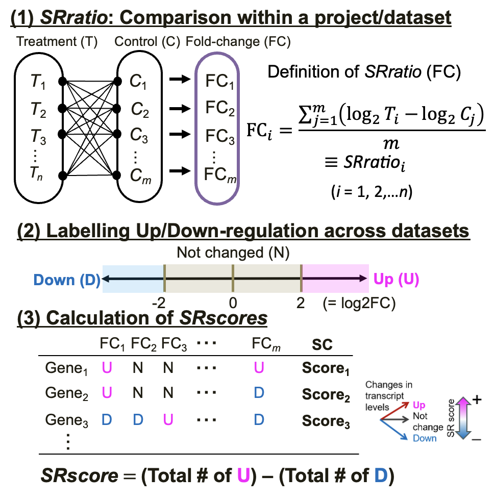

```{r, include = FALSE}
knitr::opts_chunk$set(
  collapse = TRUE,
  comment = "#>"
)
```

**R version**: `r R.version.string`

**Bioconductor version**: `r BiocManager::version()`

**Package**: `r packageVersion("SRscore")`

<style type="text/css">
.main-container {max-width: 1500px;}
</style>

# Introduction

The sharing of biological data—such as genomes, epigenomes, and transcriptomes—plays a crucial role in promoting research transparency, enabling data reuse, and facilitating large-scale data reanalysis.
Representative public repositories, including the Gene Expression Omnibus (GEO) [@10.1093/nar/gkad965], the Sequence Read Archive (SRA) [@10.1093/nar/gkab1053], and ArrayExpress [@10.1093/nar/gkaa1062], have greatly contributed to this effort.
While the value of such open data continues to increase, integrating datasets across studies remains challenging due to technical and biological variability. Differences in experimenters, reagents, instruments, species, developmental stages, and tissues can all influence the reproducibility of microarray and RNA sequencing (RNA-Seq) experiments [@FISCHER20221208].

Meta-analysis has emerged as a powerful strategy to address these challenges.
By statistically integrating results from multiple studies investigating similar hypotheses, it helps identify consistent and biologically meaningful expression patterns that might be overlooked in individual experiments [@10.1093/nar/gkr1265].
Vote-counting–based meta-analyses, for example, have identified stress-responsive genes in Arabidopsis thaliana and Oryza sativa [@life12071079 ; @10.3389/fpls.2024.1343787], and similar methods have been applied to quantify p53-dependent gene regulation [@10.1093/nar/gkw523].
Such approaches demonstrate how meta-analysis can uncover robust biological signatures from heterogeneous data sources.

In our previous study [@10.1093/plphys/kiaf105], we proposed the Stress Response score (SRscore), a new metric based on a modified vote-counting method [@biomedicines9050582 ; @life12071079].
Unlike the previously reported HN-ratio and HN-score, SRscore considers all possible combinations between control and treatment groups when computing fold-change, allowing a more comprehensive evaluation of gene responsiveness [@10.1093/plphys/kiaf105].

To make this analytical framework broadly accessible, we developed the SRscore R package, which provides a simple and intuitive workflow for transcriptome meta-analysis across multiple research projects.
The package was designed to address two major issues:
(1) existing vote-counting–based tools are not easily integrated into downstream analyses, and
(2) the manual nature of meta-analysis often limits research efficiency and reproducibility.

The SRscore package automates key steps—generating control–treatment pairs, calculating fold-changes, and summarizing expression trends—through a unified pipeline.
Its main output, SRscore, provides an intuitive measure of how consistently a gene is up- or downregulated across studies.
Furthermore, it can be seamlessly combined with other R/Bioconductor tools for downstream functional and enrichment analyses, facilitating deeper biological interpretation.

Although originally developed for transcriptome data, the underlying framework can also be applied to other omics datasets such as metabolomics.
This vignette provides a practical guide to using the SRscore package, illustrating how to calculate SRscores, perform meta-analysis, and visualize the results effectively.

# Installation
```{r}
# library(devtools)
# install_github("fusk-kpu/SRscore", build_vignettes = TRUE)
library(SRscore)
```

# Functions Overview
- `expand_by_group()`	Creates a data frame containing all possible control–treatment sample combinations within each group.

- `calcSRratio()`	Calculates the gene expression ratio between control and treatment samples.

- `calcSRscore()`	Computes the SRscore, summarizing overall gene expression trends.

- `directly_calcSRscore()`	Executes all steps above and returns the results as a list.

- `find_diffexp()`	Retrieves expression ratios for the specified gene across experiments.

<a name="sd"/>

# Sample Data

To calculate SRscore, both metadata and a gene expression matrix are required.
The SRscore package includes sample datasets that can be loaded via `data()` and are used in the Example Workflow
.

## MetadataABA

Metadata describe the experimental dataset, including sample IDs and conditions.
`MetadataABA` provides metadata for Arabidopsis thaliana under ABA stress.
These data define pairs of control and treatment samples within each study.

Columns:

- **Series**: Experimental dataset ID

- **control_sample**: Control sample ID

- **treated_sample**: Treatment sample ID

- treatment: Treatment condition (optional)

- tissue: Tissue name (optional)

```{r}
library(tibble)
data("MetadataABA")
tibble(MetadataABA)
```

## TranscriptomeABA

`TranscriptomeABA` is a gene expression matrix for Arabidopsis thaliana under ABA stress conditions.
The first column is the gene ID, and the remaining columns represent sample IDs.
The data were processed from raw CEL files and normalized using Robust Multi-array Average (RMA) [@Irizarry2003-uj].
To reduce file size, only 1,000 genes are included.

```{r}
data("TranscriptomeABA")
tibble(TranscriptomeABA)
```

## SRGA (Stress Responsive Gene Atlas)

`SRGA` is a data frame integrating SR scores across 11 distinct stress conditions [@10.1093/plphys/kiaf105]. Since the SR score scale varies by stress type, it was standardized using z-scores. To reduce file size, only 1,000 genes are included. By utilizing [template matching](#tm) [@Pavlidis2001-ie], genes exhibiting similar SRscore patterns under each stress condition can be extracted.

```{r}
data("SRGA")
tibble(SRGA)
```

<a name="ew"/>

# Example Workflow
## 1. Generate Comparison Pairs

Use `expand_by_group()` to generate all control–treatment combinations within each dataset (Series).

```{r comparison}
grp <- "Series"
var1 <- "control_sample"
var2 <- "treated_sample"

ebg <- expand_by_group(
  .data = MetadataABA,
  grp = grp,
  var1 = var1,
  var2 = var2
)

unique_series <- unique(MetadataABA$Series)
unique_series

lapply(unique_series, function(x) subset(ebg, Series == x))
```

## 2. Calculate SRratio

`calcSRratio()` computes gene expression ratios (treated/control) for each combination.
If data are already log-transformed, `set is.log = TRUE`; otherwise, it will apply a log transformation.

```{r SRratio}
SRratio <- calcSRratio(
  .data = TranscriptomeABA,
  var1 = var1,
  var2 = var2,
  pair = ebg,
  is.log = TRUE
)

tibble(SRratio)
```

Alternatively, you can calculate SRratio directly without using `expand_by_group()`, as in [@life12071079].

```{r conventional SRratio}
conventional_SRratio <- calcSRratio(
  TranscriptomeABA,
  var1 = var1,
  var2 = var2,
  pair = MetadataABA,
  is.log = TRUE
)

tibble(conventional_SRratio)
```

## 3. Calculate SRscore

`calcSRscore()` summarizes how often each gene is up- or down-regulated across studies.
By default, SRratio ≥ 2 is considered up-regulated and SRratio ≤ -2 is down-regulated.

```{r SRscore}
SRscore <- calcSRscore(SRratio, threshold = c(-2, 2))
head(SRscore)
tibble(SRscore)
```

## All-in-One Execution

`directly_calcSRscore()` performs all the steps above and returns the results as a list.

```{r All in one}
res <- directly_calcSRscore(
  .data1 = MetadataABA,
  grp = grp,
  var1 = var1,
  var2 = var2,
  .data2 = TranscriptomeABA,
  is.log = TRUE
)

names(res)
tibble(res$SRscore)
```

# Visualization

## Expression Pattern of a Specified Gene

`find_diffexp()` extracts SRratio and metadata for specified genes to visualize expression patterns.

```{r}
set.seed(1)
res <- find_diffexp(
  sample(SRratio$ensembl_gene_id, 1),
  SRratio,
  SRscore,
  MetadataABA
)

tibble(res$result)
tibble(res$SRscore)
```

Multiple genes can also be specified:

```{r}
set.seed(1)
res2 <- find_diffexp(
  sample(SRratio$ensembl_gene_id, 10),
  SRratio,
  SRscore,
  MetadataABA
)

tibble(res2$result)
tibble(res2$SRscore)
```

A heatmap visualization using the *ComplexHeatmap* package [@Gu2016-ez] can help summarize patterns.

```{r}
library(ComplexHeatmap)
library(RColorBrewer)

cor_breaks <- seq(-2, 2, length.out = 51)
cor_color <- colorRampPalette(c("blue", "white", "red"))(51)

annotation_row <- res2$result[, c("treatment", "tissue")]
pal_treatment <- brewer.pal(length(unique(annotation_row$treatment)), "Set1")
pal_tissue <- brewer.pal(length(unique(annotation_row$tissue)), "Set2")

names(pal_treatment) <- unique(annotation_row$treatment)
names(pal_tissue) <- unique(annotation_row$tissue)

ComplexHeatmap::pheatmap(
  as.matrix(res2$result[, sapply(res2$result, is.numeric)]),
  breaks = cor_breaks,
  color = cor_color,
  cluster_rows = FALSE,
  name = "SRratio",
  annotation_row = annotation_row,
  annotation_colors = list(
    treatment = pal_treatment,
    tissue = pal_tissue
    )
)
```

## Enrichment Analysis

Genes with consistently altered expression (higher |SRscore|) can be analyzed for functional enrichment.
Example: GO enrichment for genes with SRscore ≥ 1 using *clusterProfiler* [@Yu2012-si].

```{r}
library(clusterProfiler)
library(ggplot2)

ego <- enrichGO(
  gene = SRscore$ensembl_gene_id[SRscore$score >= 1],
  OrgDb = "org.At.tair.db",
  keyType = "TAIR",
  ont = "BP",
  maxGSSize = 2000
)

dotplot(ego, showCategory = 5, font.size = 14) +
  theme(text = element_text(size = 14))
```

<a name="tm"/>

## Template Matching

Template matching [@Pavlidis2001-ie] identifies genes with similar SRscore patterns.
Here, the five most similar genes to *Gols3* (AT1G09350) are found using the Euclidean distance.

```{r}
library(genefilter)
library(DT)

cl <- colnames(Filter(is.numeric, SRGA))
df <- as.matrix(column_to_rownames(SRGA, var = "ensembl_gene_id")[cl])

template <- "AT1G09350"

close_genes <- genefinder(
  df,
  ilist = template,
  numResults = 5,
  method = "euclidean"
)

datatable(
  SRGA[SRGA$ensembl_gene_id == template, ],
  options = list(dom = "lrtBip"),
  rownames = FALSE
)

datatable(
  SRGA[close_genes[[1]]$indices, ],
  options = list(dom = "lrtBip"),
  rownames = FALSE,
)
```

# Summary of Outputs

## Output	Description
Comparison pairs	Lists all control–treatment sample pairs within each study.
SRratio	Gene-wise expression ratios for each comparison.
SRscore	Summarizes overall up/down-regulation frequency per gene.

Together, these outputs form a reproducible and scalable framework for identifying stress-responsive genes across diverse datasets.
By automating complex steps and standardizing analysis, the SRscore package helps researchers efficiently derive meaningful biological insights.

# Session info

```{r}
sessionInfo()
```

# References

<br>

The following figure illustrates the process of deriving the SRscore.


Figure 1. **Detailed calculation of SRscores.** We identified stress-responsive genes using the Stress Responsive (SR) score, which is shown here. Essentially, it is based on the fold change (FC) in gene expression between the two groups, a modification of the approach reported in Tamura and Bono (2022). The difference from the HN-ratio and HN-score in Tamura and Bono (2022) is whether or not FC calculations are performed on all pairs of combinations of the treatment and control groups. In Step (1), FC is calculated for all pairs of combinations of the treatment and control groups within a project/dataset and their mean value is obtained, which is called SRratio. This procedure is intended to reduce batch effects, which means systematic nonbiological variations that arise from differences in the experimental conditions across different batches of samples. Please note that we used log2FC for both platforms. In Step (2), the FC value is considered to be upregulation (“U”)/downregulation (“D”) at a certain threshold; here, |SRratio| ≥2 and those with no change in magnification near zero are considered to be not changed (a high SRscore can be interpreted as a tendency toward consistent upregulation in many research projects, whereas a low SRscore indicates a tendency toward consistent downregulation). N). In Step (3), the total number of “U” or “D” labels calculated in this manner is subtracted to obtain the SRscore. Roughly, it is a modification of the vote-counting system. Finally, we obtained Z-scored SRscores for further analysis and construction of the AtSRGA.
