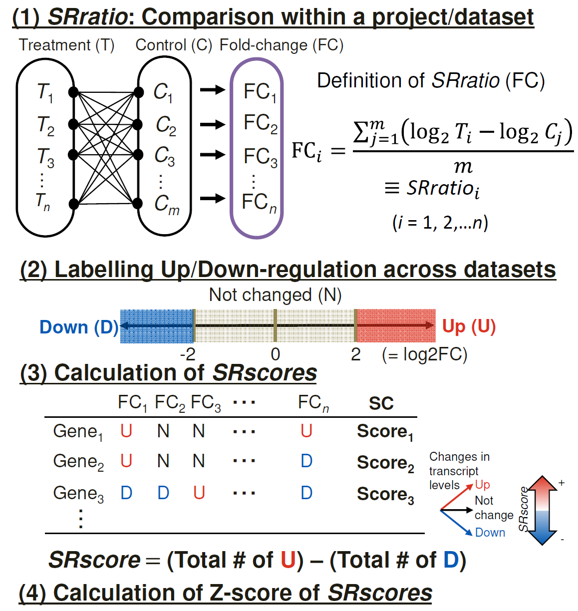

```{r, include = FALSE}
knitr::opts_chunk$set(
  collapse = TRUE,
  comment = "#>"
)
```

**R version**: `r R.version.string`

**Bioconductor version**: `r BiocManager::version()`

**Package**: `r packageVersion("SRscore")`

<style type="text/css">
.main-container {max-width: 1500px;}
</style>


# Introductions
Meta-analysis is a statistical technique used to combine data from multiple studies on similar hypotheses and is widely applied in genomic research [@10.1093/nar/gkr1265]. For example, meta-analyses have been used to identify genes that respond to specific stress conditions, revealing both common and unique genes affected by multiple stresses rather than just a single stress. Various meta-analyses, particularly those using transcriptome data, have been conducted to search for and predict the functions of stress-responsive genes [@life12071079 ; @10.3389/fpls.2024.1343787]. As reported in a previous study [@life12071079], we computed Stress Response scores (SRscores) using a modified version of the vote-counting method [@10.1093/nar/gkr1265] for each stress condition. The difference from the HN-ratio and HN-score in Tamura and Bono (2022) is whether or not fold-change calculations are performed on all pairs of combinations of the treatment and control groups (Fukuda et al. in press).

The development of the SRscore package was born out of the need to simplify and standardize the meta-analysis of gene expression data across multiple research projects. As the value of using historical data increases, researchers in the field of transcriptomics are increasingly dealing with complex data sets containing a wide variety of control and processing conditions applied to different biological samples and experimental designs.This diversity can make it difficult to consistently compare the effects of treatments on gene expression across studies.

Traditionally, these comparisons have been carried out using ad-hoc scripts or custom workflows, which can be error-prone and difficult to reproduce. Furthermore, with increasing research projects and datasets, it is clear that there was a need for an efficient and automated method.

**SRscore** package was developed to address these issues. It introduces a streamlined and reproducible workflow for generating control-treatment comparisons, calculating gene expression ratios, and scoring gene regulation patterns.

The package simplifies analysis, enhances reproducibility, and helps researchers focus on interpreting the biological significance of their results, rather than spending time on data wrangling or manual calculations. The basic functions of the SRscore package can be applied not only to transcriptome data but also to metabolome data.

This vignette provides a practical explanation of how to calculate SR scores and gives examples of the data and visualizations needed to do so.

# Installation
```{r}
# install.packages("SRscore")
library(SRscore)
```

# Functions
- `expand_by_group()`: Create a data frame from all combinations between two specified variables within each group
- `calcSRratio()`: Calculates the gene expression ratio between control and treatment samples for each combination.
- `calcSRscore()`: Computes the SRscore, summarizing the overall gene expression trends.
- `directly_calcSRscore()`:Aggregate the results of the above three functions into a single list
- `find_diffexp()`: Find the expression ratio for each experimental sample for the specified gene.


# Sample Data

Metadata and gene expression matrices are required to calculate SRscore. The following are sample data built into the SRscore package and can be called from `data()`.

## MetadataABA

In transcriptome analysis, a file called metadata, which describes information about the experimental data set, such as sample IDs and conditions, is important.
`MetadataABA` is the metadata for the experimental dataset related to Arabidopsis thaliana under ABA stress conditions. Metadata are used to define pairs for comparison between the target sample group and the experimental sample group. The information required here is, for example, the identification ID of each experimental data set, control sample, and experimental sample used in a database such as NCBI GEO; other information is optional.

About columns：

- Series : Identification ID of the experimental data set
- control_sample : Identification ID of control sample
- treated_sample : Identification ID of treated sample
- treatment : Description of process (optional)
```{r}
library(tibble)
data("MetadataABA")
tibble(MetadataABA)
```

## TranscriptomeABA
This is a gene expression matrix for Arabidopsis under ABA stress conditions. The first column is the gene ID column, all others are sample ID columns. The expression data are read as raw data (CEL files) and summarized and normalized by Robust Multi-array Average (RMA). To keep the file size small, the data is limited to 1,000 genes.
```{r}
data("TranscriptomeABA")
tibble(TranscriptomeABA)
```

## SRGA (Stress Responsive Gene Atlas)
This was created by integrating SRscore calculated individually from experimental data sets of different stress conditions. A total of 11 stress conditions were used, including ABA, cold, drought, heat, hypoxia, and salt stress. Since there was variation in the scale of SRscore for each stress condition, it was standardized by z-score. Subsequent Template Matching 
[@Pavlidis2001-ie] searched for genes with similar SRscore patterns under different stress conditions based on SRGA.

Translated with www.DeepL.com/Translator (free version)

```{r}
data("SRGA")
tibble(SRGA)
```

# Example Workflow
Here is a workflow with sample data.

## 1. Expanding Condition Combinations Across Research Projects
The first step in our workflow is generating all combinations of control and treatment conditions across research projects using the `expand_by_group()`.

```{r}
grp <- "Series"
var1 <- "control_sample"
var2 <- "treated_sample"

ebg <- expand_by_group(.data = MetadataABA, 
                       grp = grp,
                       var1 = var1,
                       var2 = var2)

# View the unique research projects
unique_series <- unique(MetadataABA$Series)
unique_series

# Subset the expanded data for each research project
lapply(unique_series, function(x) subset(ebg, Series == x))
```

In this example, `expand_by_group()` takes a data frame (MetadataABA) and generates combinations of control and treatment samples for each research project (Series).

## 2. Calculating SRratio
Next, we use `calcSRratio()` to calculate SRratio. SRratio is the gene expression ratio calculated over different research projects, based on all combinations between target and experimental samples obtained in each. SRratio is essential for the calculation of SRscore.This function allows you to specify whether the data is log-transformed.

```{r}
SRratio <- calcSRratio(.data = TranscriptomeABA, 
                       var1 = var1,
                       var2 = var2, 
                       pair = ebg, 
                       is.log = TRUE)

# Preview the SRratio data frame
tibble(SRratio)
```

In this example, calcSRratio() calculates the gene expression ratios for control and treated samples based on the input data frame (TranscriptomeABA).

It is also possible to calculate SRratio directly without using expand_by_group().This calculation method was used in [@life12071079].
```{r}
conventional_SRratio <- calcSRratio(TranscriptomeABA,
                                          var1 = var1,
                                          var2 = var2,
                                          pair = MetadataABA, 
                                          is.log = TRUE)
# Preview the SRratio data frame
tibble(conventional_SRratio)
```

## 3. Calculating SRscore
Finally, we calculate the SRscore, a metric summarizing gene expression changes across conditions and projects.

```{r}
SRscore <- calcSRscore(SRratio)

# Preview the SRscore results
tibble(SRscore)
```

The calcSRscore() function takes the SRratio data frame and computes the SRscore, which reflects how many genes are significantly up- or down-regulated across the experiments.

caluculate_SRscore() can be used for just a numerical matrix, and is expected to be used in all situations, not just this example.
```{r}
mt <- data.frame(X0 = runif(100) * 3, 
                 X1 = runif(100) * 3, 
                 X2 = runif(100) * 3, 
                 X3 = runif(100) * 3, 
                 X4 = runif(100) * 3)
smt <- calcSRscore(mt)
tibble(smt)
```

## 4. In one go

We have introduced the three functions in order to calculate SRscore. `directly_calcSRscore()` executes these functions together and stores the result of each in a list.
```{r}
directSRscore <- directly_calcSRscore(.data1 = MetadataABA,
                                            grp = grp,
                                            var1 = var1,
                                            var2 = var2,
                                            .data2 = TranscriptomeABA,
                                            is.log = TRUE)
tibble(directSRscore$SRscore)
```


# Visualization
SRscore can be used for a variety of evaluations. The following are examples.

## Examine the expression pattern of each experimental sample for the specified gene.
`find_diffexp()` can extract the SRratio and metadata of the genes of interest. This will tell you which experimental samples showed what kind of expression pattern of the specified genes.
In the following, AT1G10230 was specified as an example.
```{r}
set.seed(1)
res <- find_diffexp(sample(SRratio$ensembl_gene_id, 1),
                    SRratio,
                    SRscore,
                    MetadataABA)
tibble(res$result)
tibble(res$SRscore)
```

In the following, 10 random genes were specified.

```{r}
set.seed(1)
res2 <- find_diffexp(sample(SRratio$ensembl_gene_id, 10), 
                     SRratio,
                     SRscore,
                     MetadataABA)

tibble(res2$result)
tibble(res2$SRscore)
```

If multiple genes are specified, a heat map is more likely to provide useful information.
```{r, message=FALSE}
library(ComplexHeatmap)
library(RColorBrewer)

cor_breaks <- seq(-2, 2, length.out = 51)
cor_color <- colorRampPalette(c("blue", "white", "red"))(51)
annotation_row <- res2$result[, "treatment", drop = FALSE]
treatment_names <- unique(annotation_row$treatment)
pal <- brewer.pal(length(treatment_names),"Spectral")
names(pal) <- treatment_names

pheatmap(as.matrix(Filter(is.numeric, res2$result)),
         breaks = cor_breaks,
         color = cor_color,
         annotation_row = annotation_row,
         annotation_colors = list(treatment = pal),
         cluster_rows = FALSE,
         name = "SRratio")
```

<br>

## Enrichment analysis is performed using the value of SRscore.
SRscore is a number that deviates significantly from 0 the more the variation in expression levels under a particular condition is biased toward a particular trend across studies. Therefore, it is important to understand what biological functions a set of genes extracted based on SRscore may have together. The following is the result of Gene Ontology enrichment analysis for genes with SRscore greater than 1 as an example.

```{r fig.width=9, fig.height=8, message=FALSE}
library(clusterProfiler)
ego <- enrichGO(SRscore$ensembl_gene_id[which(SRscore$SR2 >= 1)],
                OrgDb = "org.At.tair.db",
                keyType = "TAIR",
                ont = "BP",
                maxGSSize = 2000
                )
dotplot(ego)
```

<br>

## Template matching
By applying the Template Matching [@Pavlidis2001-ie] , other genes with similar patterns can be found based on the SRscore pattern (template) that a gene has. The similarity between genes is calculated based on the specified calculation method and sorted in decreasing order. Here, the 5 genes with the most similar SRscore patterns are extracted from the 1000 genes in the sample data `SRGA`, using *Gols3*, one of the low temperature stress response genes, as an example.

```{r, warning=FALSE, message=FALSE}
library(genefilter)
library(DT)

# Data Processing
## Retrieve the name of the column that has SRscore as an element.
cl <- colnames(Filter(is.numeric, SRGA))
## Move gene IDs to row names.
df <- column_to_rownames(SRGA, var = "ensembl_gene_id")
## Converting from dataframe to matrix.
df <- as.matrix(df[cl])

# Template specification (in this case Gols3)
template <- "AT1G09350"

# Perform template matching
close_genes <- genefinder(df,
                          ilist = template,
                          numResults = 5,  # マッチング先の遺伝子の数
                          method = "euclidean"  # 類似度計算手法
                          )

# SRscore pattern for templates
datatable(SRGA[which(SRGA$ensembl_gene_id == template), ],
          options = list(columnDefs = list(list(className = 'dt-nowrap', targets = "_all")),
                         dom = "lrtBip"),
          rownames = FALSE
          )

# Matching results
datatable(add_column(SRGA[close_genes[[1]]$indices, ], 
                     "dists" = round(close_genes[[1]]$dists, digits = 3),
                     .after = max(which(sapply(SRGA, is.numeric)))),
          options = list(columnDefs = list(list(className = 'dt-nowrap', targets = "_all")),
                         dom = "lrtBip"),
          rownames = FALSE
      )
```


<br>

# Summary of Outputs
- Expanded Data Frame: Contains all combinations of control and treatment conditions for each research project.
- SRratio: A data frame with gene expression ratios between control and treatment samples.
- SRscore: A summary of gene expression changes, indicating up-regulated, down-regulated, and unchanged gene counts.

By following this workflow, you can effectively analyze gene expression data across multiple conditions and research projects, gaining insights into the overall trends in gene expression. The SRscore package simplifies the process, making it easier to manage complex transcriptomic datasets.

# Session Infomation
```{r}
sessionInfo()
```

# References

<br>

The following figure illustrates the process of deriving the SRscore.

Figure 1. **Detailed calculation of SRscores.** We identified stress-responsive genes using the Stress Responsive (SR) score, which is shown here. Essentially, it is based on the fold change (FC) in gene expression between the two groups, a modification of the approach reported in Tamura and Bono (2022). The difference from the HN-ratio and HN-score in Tamura and Bono (2022) is whether or not FC calculations are performed on all pairs of combinations of the treatment and control groups. In Step (1), FC is calculated for all pairs of combinations of the treatment and control groups within a project/dataset and their mean value is obtained, which is called SRratio. This procedure is intended to reduce batch effects, which means systematic nonbiological variations that arise from differences in the experimental conditions across different batches of samples. Please note that we used log2FC for both platforms. In Step (2), the FC value is considered to be upregulation (“U”)/downregulation (“D”) at a certain threshold; here, |SRratio| ≥2 and those with no change in magnification near zero are considered to be not changed (a high SRscore can be interpreted as a tendency toward consistent upregulation in many research projects, whereas a low SRscore indicates a tendency toward consistent downregulation). N). In Step (3), the total number of “U” or “D” labels calculated in this manner is subtracted to obtain the SRscore. Roughly, it is a modification of the vote-counting system. Finally, we obtained Z-scored SRscores for further analysis and construction of the AtSRGA.
